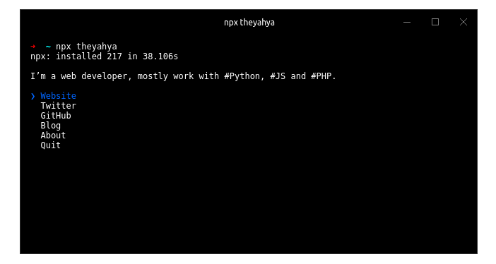

# theyahya [](https://travis-ci.org/theyahya/theyahya)

> [TheYahya](https://theyahya.com) CLI




## Usage

Install Node.js, then:

```
$ npx theyahya
```


## Built with

- [ink](https://github.com/vadimdemedes/ink) - React for interactive command-line apps
- [terminal-image](https://github.com/sindresorhus/terminal-image) - Display images in the terminal


## License

MIT © [TheYahya](https://theyahya.com)
